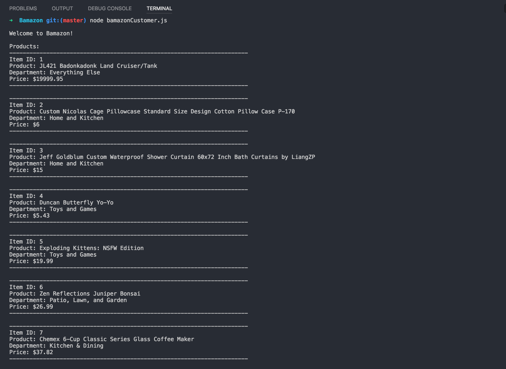
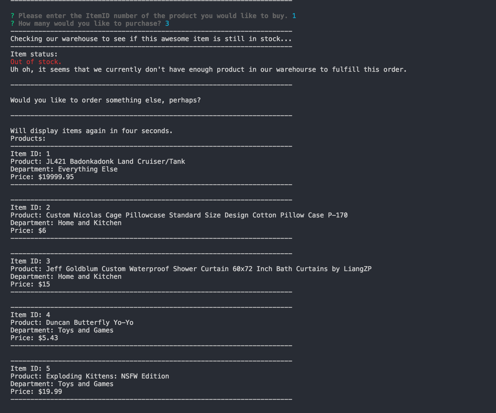
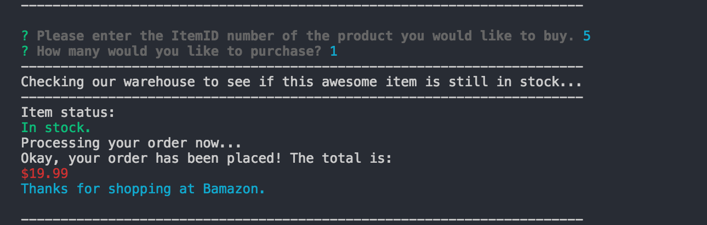
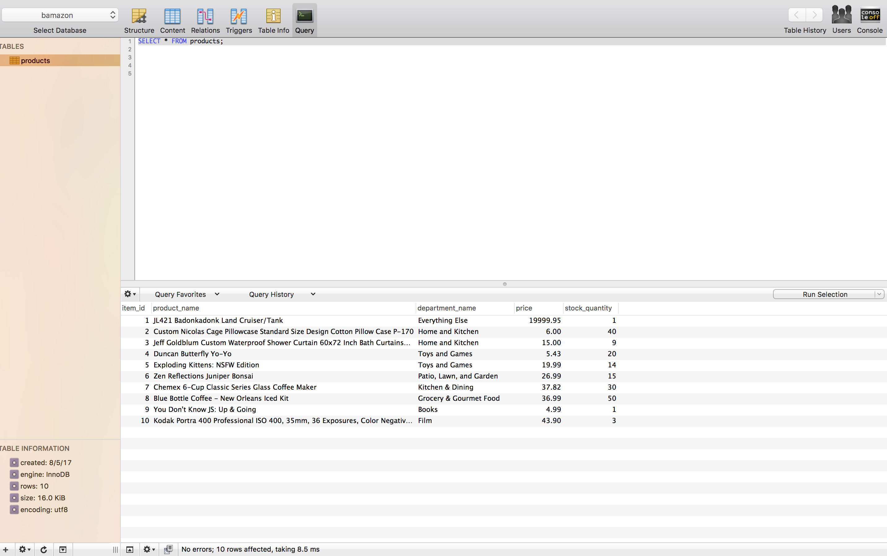

# Bamazon
Bamazon is a Command Line Interface (CLI) app that accepts orders from customers and depletes stock from the store's inventory. It runs on Node.js and MySQL. 

## Getting started

1. Open your command line (CLI) program (*e.g.*, Bash (Windows), Terminal (Mac), etc.)

2. Clone or fork this repo to your computer (hint: you will need [Node.js](https://nodejs.org/en/download/) installed to run this app.)

3. Install the required packages:
```
npm install
```

OR

Install them manually:

   * [Inquirer](https://www.npmjs.com/package/inquirer) - asks the user questions and notes the response.
   ````
   npm install inquirer
   ````
   * [mysql](https://www.npmjs.com/package/mysql) -
   This is a node.js driver for mysql. It is written in JavaScript, does not require compiling, and is 100% MIT licensed.
   ````
   npm install mysql
   ````
   * [Colors](https://www.npmjs.com/package/colors) - adds color to text to enhance readability.
   ````
   npm install colors
   ````
4. To run the application, type 
```
node bamazonCustomer.js
```
The system will display the products currently in inventory and, after an Item ID is entered, the order will either be placed (and the inventory will be decreased in accordance with the quantity ordered) or – if there isn't enough stock of the item in question — you will be informed that the order cannot be placed. 

## Demo

[Walkthrough](https://youtu.be/CUhP7hABPhg) on YouTube.

## Screenshots









## Copyright

Jake Thornberry (C) 2017.


